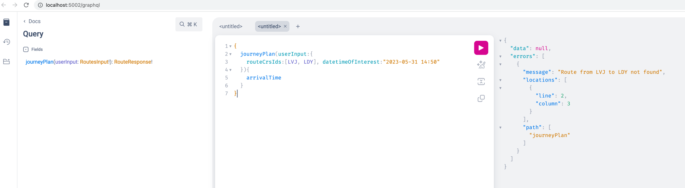

Contilio Train Journey Planner
==============================

Overview
--------
A python GraphQL API service to demo basic functions of a user led train station journey planner.

Assumptions
-----------

* Major assumption is that this whole exercise focuses more on software design patterns and pythonic constructs,
  rather than finding the most optimised algorithm to arrive from point A to point B
* Another unreal assumption, but we live in an ideal world where there are no cancellations or delays and train 
  schedules are always the same. Hence, it would be beneficial to store the data in a database as a cache, 
  to speed up subsequent requests of the same nature
* `MAX_WAIT_TIME_IN_MINUTES`: The time that is checked waiting on first train to arrive, or between waiting 
  at one station to the next
* The starting time provided by the user is always valid and appropriate for the requested route. If a starting 
  time was given that didn't match up with train schedules (for example, if the time was past the last train's 
  departure), the implementation would throw an exception
* A route with lesser than 2 train stations is invalid
* The route is to be traversed exactly as provided, from left to right
* A train station CRS code has to be an enum value within `UKTrainStationCode`
* SHA256 hashing algorithm has been deemed fit for purpose to cache visited routes
* Alembic is the tool to handle migrations on the persistence model

Development Requirements
------------------------

* [Pyenv](https://github.com/pyenv/pyenv) if you want to emulate different versions of python instead of overriding the installed python on your machine
* [Python 3.10.0 or higher](https://www.python.org/downloads/release/python-3100/) Just for compatibility reasons make sure you have the right version of python installed
* [Poetry](https://python-poetry.org/) as a package dependency management solution
* [Docker](https://www.docker.com/) if you want to containerise the world and make it reproducible

Setup
-----
* Run `make install` to build the world

How to:
-------
* `make lint`: cleans up using ([black](https://pypi.org/project/black/), [flake8](https://pypi.org/project/flake8/))
* `make tests`: runs the unit tests
* `make run`: runs the script with a default input file path parameter, feel free to override using;
  - :warning: Make sure to run `poetry config virtualenvs.in-project true` prior, so the virtual env lives within the project directory
  - :bangbang: Make sure to update the `TRANSPORT_API_APP_ID` and `TRANSPORT_API_APP_KEY` in `.env` to valid ones
    to be able to query against [TransportApi](https://transportapi.com) endpoint
* `docker compose up`: builds a containerised image of the app and spins it up in a virtual env exposing it at http://localhost:5002/graphql
  - :bangbang: Make sure to update the transport api env variables in `docker-compose.yml` to a valid ones.

Running Queries on GraphQL Playground
-------------------------------------
If you either run `make run` or `docker compose up`, in both scenarios you will be greeted with a GraphQL playground at http://localhost:5002/graphql

Please enter the following query and then press the play button :arrow_forward: to execute the query as seen in the image below:
```
{
  journeyPlan(userInput:{
    routeCrsIds:[LBG, SAJ, ABW, DDK], datetimeOfInterest:"2023-05-31 15:50"
  }){
    arrivalTime
  }
}
```



Troubleshooting
---------------

* If you get an error like this after installing pyenv and pointing to the right python version:
```bash
make: *** [lint] Error 1
(base) .. contilio % ./bin/run-black.sh

Current Python version (3.9.12) is not allowed by the project (^3.10).
Please change python executable via the "env use" command.
```
Then try running these commands in the root:
```bash
$ rm -rf .venv
$ pyenv local 3.10.0
$ poetry env use 3.10.0
$ make install
```
This forces poetry to look at the pyenv version instead